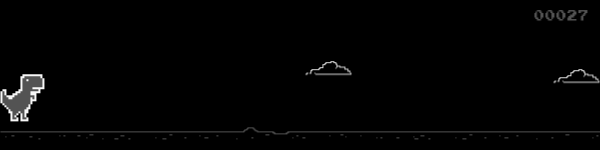
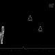

# Screenshot Capture Process

## Overview

The browser-based Dino environment captures game screenshots at 20 FPS (50ms intervals) and preprocesses them into 80x80 grayscale images optimized for CNN input. This document describes the complete capture pipeline.

## Capture Pipeline

### 1. Canvas-First Strategy

The system prioritizes capturing the HTML5 canvas element directly, which contains **pure game graphics** without any UI clutter.

```python
canvas = driver.find_element(By.TAG_NAME, 'canvas')
png = canvas.screenshot_as_png
```

**Canvas Dimensions:** 600x150 pixels

### 2. Screenshot Examples

#### Raw Canvas Capture (600x150)

The canvas contains only the game elements:


**What's captured:**
- ✅ Dinosaur sprite
- ✅ Obstacles (cacti and birds)
- ✅ Ground line
- ✅ Score counter (top right)
- ✅ Clouds (background)
- ❌ No scoreboard tables
- ❌ No buttons or UI elements
- ❌ No advertisements

#### Processed Screenshots

**Step 1: Canvas Capture (600x150)**


Pure game content from the HTML5 canvas element.

---

**Step 2: Grayscale Conversion**



Converted to grayscale for efficient processing and to reduce dimensionality.

---

**Step 3: Final Resized (80x80)**



Resized to 80x80 using LANCZOS resampling for neural network input. Despite the small size, all critical game elements remain visible:
- Dinosaur position
- Obstacle locations
- Ground reference
- Relative distances

## Processing Steps

### 1. Image Capture
```python
# Primary: Capture canvas element (pure game)
canvas = driver.find_element(By.TAG_NAME, 'canvas')
png = canvas.screenshot_as_png
img = Image.open(io.BytesIO(png))
```

### 2. Grayscale Conversion
```python
# Convert to single-channel grayscale
img_gray = img.convert('L')
```

### 3. Resizing
```python
# Resize to 80x80 using high-quality LANCZOS resampling
img_resized = img_gray.resize((80, 80), Image.Resampling.LANCZOS)
```

### 4. Array Conversion
```python
# Convert to numpy array for neural network
img_array = np.array(img_resized, dtype=np.uint8)
# Shape: (80, 80), dtype: uint8, range: [0, 255]
```

## Fallback Strategy

If canvas capture fails, the system falls back to full-page screenshot with intelligent cropping:

```python
# Get full page screenshot
png = driver.get_screenshot_as_png()
img = Image.open(io.BytesIO(png))

# Crop to top portion only (where game canvas is located)
width, height = img.size
game_region = img.crop((0, 0, width, min(int(height * 0.35), 300)))
```

This ensures only the game area is captured, excluding scoreboards and buttons below.

## Observation Space

**Final observation shape:** `(80, 80)` grayscale image

**Type:** `numpy.ndarray` with `dtype=uint8`

**Value range:** 0-255 (black to white)

**Contents:**
- Background: Black (value ~0)
- Game sprites: White/gray (values ~200-255)
- Ground line: White line
- Score: White text (top right)

## Performance Characteristics

| Metric | Value |
|--------|-------|
| Capture rate | 20 FPS (50ms/frame) |
| Raw canvas size | 600x150 pixels |
| Final observation size | 80x80 pixels |
| Color space | Grayscale (1 channel) |
| Memory per frame | 6.4 KB |
| Processing overhead | ~5-10ms per frame |

## Ad Blocking

The environment automatically hides advertisements and unnecessary content using JavaScript:

```javascript
// Hide all ads and content below canvas
var ads = document.querySelectorAll('iframe, .ad, .advertisement, [id*="ad"], [class*="ad"]');
ads.forEach(function(ad) { 
    if (ad.tagName !== 'CANVAS') {
        ad.style.display = 'none'; 
    }
});
```

This ensures:
1. Clean visual environment in browser
2. Pure canvas capture without interference
3. Reduced browser overhead
4. No ads in screenshots

## Verification

To verify screenshot capture is working correctly:

```bash
# Run debug script to visualize the pipeline
python debug_screenshot.py
```

This will generate debug images showing each step of the process:
- `debug_canvas.png` - Raw canvas capture
- `debug_canvas_grayscale.png` - After grayscale conversion
- `debug_final_80x80.png` - Final processed observation

## Visual Comparison

### Before Optimization
- ❌ Full page captures included scoreboards, buttons, ads
- ❌ Inconsistent cropping
- ❌ Low frame variation (mostly white/blank)

### After Optimization
- ✅ Canvas-only capture (pure game)
- ✅ Consistent 600x150 game area
- ✅ High contrast with clear game elements
- ✅ 80x80 maintains essential spatial information

## Integration with RL Training

The observation is returned by `env.step(action)` and `env.reset()`:

```python
env = BrowserDinoEnv(headless=False, target_fps=20)
obs, info = env.reset()  # obs.shape = (80, 80)

action = 1  # Jump
obs, reward, terminated, truncated, info = env.step(action)
# obs contains the latest 80x80 game screenshot
```

The neural network processes this 80x80 grayscale image to:
1. Detect dinosaur position
2. Identify obstacle locations and types
3. Estimate distances
4. Make action decisions (run, jump, duck)

## Technical Notes

### Why 80x80?
- Standard size for Atari DQN implementations
- Good balance between spatial detail and computational efficiency
- Small enough for fast CNN processing
- Large enough to distinguish game elements

### Why Grayscale?
- Reduces dimensionality (1 channel vs 3 RGB channels)
- Game is monochrome anyway (black background, white sprites)
- Faster processing and training
- Less memory usage

### Why Canvas Capture?
- Most accurate (pure game graphics)
- No ads or UI elements
- Consistent dimensions (600x150)
- Fastest capture method
- No cropping needed

## Troubleshooting

### Issue: Blank/white screenshots
**Solution:** Ensure game has started before capturing (wait 1-2 seconds after page load)

### Issue: Screenshots include scoreboards
**Solution:** Canvas capture should prevent this. If using fallback, check cropping parameters.

### Issue: Low frame variation
**Solution:** Verify game is actually running and dinosaur is moving. Check FPS settings.

### Issue: Stale element errors
**Solution:** Elements are re-found after page refresh to prevent stale references.

## Summary

The screenshot capture system provides:
- ✅ **20 FPS** capture rate (50ms intervals)
- ✅ **Canvas-first** strategy for pure game content
- ✅ **Ad blocking** to eliminate visual clutter
- ✅ **80x80 grayscale** optimized for CNNs
- ✅ **Consistent observations** for stable RL training
- ✅ **Debug mode** for visual verification

This pipeline ensures the RL agent receives high-quality, consistent observations of the game state for effective learning.
